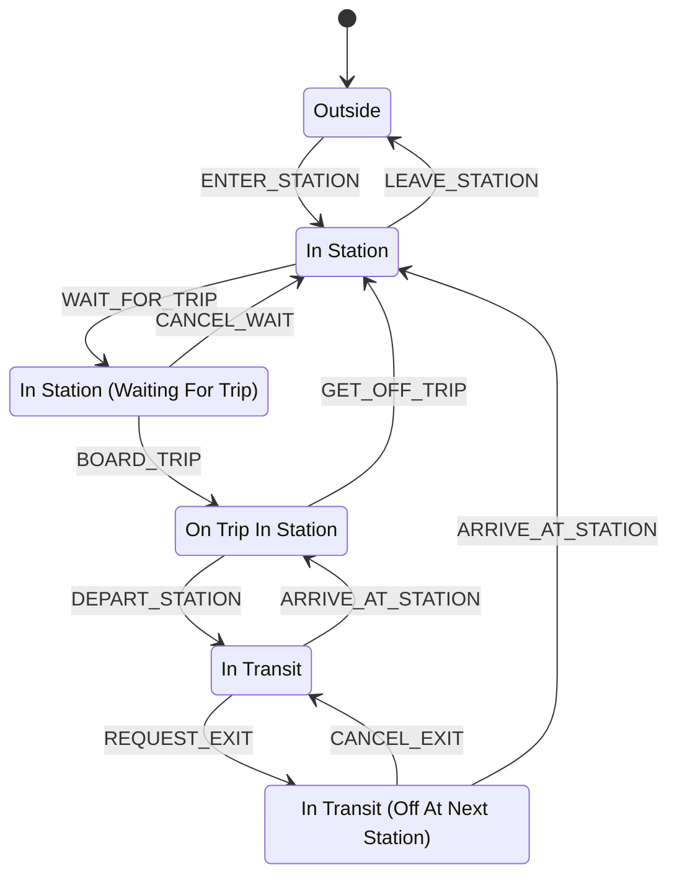

# Game State Machine

This is the agreed definition of the player's finite state machine (FSM),
implemented by the shared frontend game state model. It has **six states**,
**ten events**, **eleven allowed transitions**, and starts in **Outside**.

## States

| State | Meaning |
| --- | --- |
| Outside | The player is outside the station. This is the initial state. |
| In Station | The player is inside the station and off the train. |
| In Station (Waiting For Trip) | The player is waiting to board a trip. |
| On Trip In Station | The player is aboard a train stopped at a station. |
| In Transit | The player is aboard a moving train and plans to stay aboard at the next stop. |
| In Transit (Off At Next Station) | The player is aboard a moving train and has requested to get off at the next station. |

“On Train In Station” refers to **On Trip In Station**; it is not an additional
state. “On Trip” and “On Trip (Off At Next Station)” refer to the existing
**In Transit** and **In Transit (Off At Next Station)** states, respectively.

## Information per state

| State | Information available through `useGameState()` |
| --- | --- |
| Outside | `stationId: string \| null`; `null` means no station has been selected. |
| In Station | `stationId: string`; `nextTrips: { tripId: string; departureGameTimeMs: number }[]`. |
| In Station (Waiting For Trip) | `tripId: string`; retained `stationId: string` for cancellation. |
| On Trip In Station | `tripId: string`; `stopArrivalGameTimeMs: number`; derived `remainingStopTimeMs: number`. |
| In Transit (Off At Next Station) | `tripId: string`; `nextStopId: string`. |
| In Transit | `tripId: string`. |

The state and its fields form a discriminated union. Components narrow on
`state` to access the relevant information; unrelated fields are not retained
on the public snapshot. Station and trip IDs must be nonempty strings. Only
the initial Outside state may have an unselected station.

`stationId` identifies a parent station, while `nextStopId` identifies a stop
on a trip. These are distinct IDs: a station may be `101` while its stop is
`101S`. The caller supplies the parent station on arrival or disembarkation;
the FSM does not guess it by stripping characters from a stop ID.

Upcoming trips are supplied by the caller, with absolute epoch-millisecond
departure timestamps on the game clock. The model stores the supplied list;
the hook derives `nextTrips` by including departures at or after the current
game time and before the next local midnight, sorted earliest first. An empty
list means no upcoming trips were supplied or remain in that interval. Leaving
and later reentering a station requires a newly supplied list, while cancelling
waiting restores the list retained for that station.

Each stop lasts **30 game seconds**. The model stores the supplied stop arrival
timestamp; the hook derives `remainingStopTimeMs` as
`clamp(stopArrivalGameTimeMs + 30_000 - gameTimeMs, 0, 30_000)`. Boarding partway
through a stop uses that stop's original arrival time. Reaching zero does not
send a departure event automatically. A future scheduling integration can use
the trip ID and game time to resolve the current station; no such lookup is
performed by the current frontend.

## State diagram

## Allowed transitions

| Current state | Event | Next state |
| --- | --- | --- |
| Outside | `ENTER_STATION` | In Station |
| In Station | `LEAVE_STATION` | Outside |
| In Station | `WAIT_FOR_TRIP` | In Station (Waiting For Trip) |
| In Station (Waiting For Trip) | `CANCEL_WAIT` | In Station |
| In Station (Waiting For Trip) | `BOARD_TRIP` | On Trip In Station |
| On Trip In Station | `GET_OFF_TRIP` | In Station |
| On Trip In Station | `DEPART_STATION` | In Transit |
| In Transit | `ARRIVE_AT_STATION` | On Trip In Station |
| In Transit | `REQUEST_EXIT` | In Transit (Off At Next Station) |
| In Transit (Off At Next Station) | `CANCEL_EXIT` | In Transit |
| In Transit (Off At Next Station) | `ARRIVE_AT_STATION` | In Station |

## Rules

- Only the transitions listed above are allowed. Every other state/event
  combination is rejected without changing the state.
- `GET_OFF_TRIP` allows the player to get off immediately while the train is
  stopped. While moving, the player uses `REQUEST_EXIT` instead.
- `ARRIVE_AT_STATION` keeps the player aboard in **On Trip In Station** unless
  an exit was requested. With an exit requested, arrival takes the player
  directly to **In Station**.
- `CANCEL_EXIT` means the player will stay aboard at the next arrival.
- `LEAVE_STATION` is available only in **In Station**. A waiting player must
  cancel waiting first; an onboard player must get off first.
- Arrival and departure events describe state changes. Their automatic timing
  and triggers will be defined when scheduling is implemented.

## Runtime API

`createGameStateMachine(initialStationId: string | null = null)` in
`src/game-state/state-machine.ts` creates one independent machine in **Outside**.
It exposes:

- `getSnapshot()` returns a read-only snapshot containing `state` and its stored
  fields, with the same object returned until an allowed transition or initial
  station selection succeeds.
- `selectStartingStation(stationId)` initializes the station without changing
  the Outside state. It returns `true` only for a nonempty ID while Outside with
  `stationId: null`. Invalid IDs or later selections return `false` and preserve
  the snapshot. This setup action adds no FSM event or transition.
- `send(event)` returns `true` and updates the model synchronously for an allowed
  transition with valid information. It returns `false` for an invalid event or
  payload, preserving the existing state and snapshot. Consecutive calls always
  use the latest committed state.

`getGameStateInfo(snapshot, gameTimeMs)` derives the upcoming-trips view and
stopped-train countdown without changing the model snapshot. `gameTimeMs` and
event timestamps are absolute epoch milliseconds; no time-of-day parsing or
service-date scheduling is performed.

### Event payloads

Events carrying information use `{ type, ...payload }` objects:

| Event | Payload and behavior |
| --- | --- |
| `ENTER_STATION` | Optional `stationId` and `nextTrips`. Uses the current Outside station when `stationId` is omitted; rejects entry if no station is selected. Omitted `nextTrips` defaults to an empty list. |
| `LEAVE_STATION` | No payload. Carries the current station ID into Outside. |
| `WAIT_FOR_TRIP` | Required `tripId`. Retains the current station and its supplied trips for cancellation. |
| `CANCEL_WAIT` | No payload. Restores the station and its supplied trip list; the hook filters that list against the current game time. |
| `BOARD_TRIP` | Required `stopArrivalGameTimeMs`. Carries the selected trip into On Trip In Station. |
| `GET_OFF_TRIP` | Required `stationId`; optional `nextTrips`, defaulting to an empty list. Returns to the supplied parent station. |
| `DEPART_STATION` | No payload. Carries the trip ID into In Transit. |
| `ARRIVE_AT_STATION` | Required `stationId` and `stopArrivalGameTimeMs`; optional `nextTrips`, defaulting to an empty list. Staying aboard records the stop arrival time; an exit request instead moves to the supplied station and trip list. |
| `REQUEST_EXIT` | Required `nextStopId`. Carries the trip ID into In Transit (Off At Next Station). |
| `CANCEL_EXIT` | No payload. Keeps the trip ID and clears the exit request. |

Bare strings remain supported for `ENTER_STATION`, `LEAVE_STATION`,
`CANCEL_WAIT`, `DEPART_STATION`, and `CANCEL_EXIT`. Bare `ENTER_STATION` requires
an already selected Outside station. The other events require their documented
payloads. Missing or invalid IDs, trip-list records, or timestamps are rejected.
The caller is responsible for supplying the correct trip, stop, and station;
the FSM does not validate them against a backend schedule.

The `GameState` IDs are `outside`, `in_station`, `waiting_for_trip`,
`on_trip_in_station`, `in_transit`, and `in_transit_off_at_next_station`.
`GAME_STATE_LABELS` maps these IDs to the display names above. Events use the
exact uppercase names in the transition table.

`GameStateProvider` owns the app's shared machine and accepts an optional
`initialStationId` prop. `useGameState()` from `src/game-state/context` exposes
the state-specific information above plus `send` and `selectStartingStation`.
The provider belongs inside
`GameClockProvider`, since the hook uses the shared game clock for its derived
information. See the [README example](../README.md#game-state-machine) for usage.
The Player state card displays the current label and fields between the wallet
and clock, with **Not selected** for the app's initial `stationId: null`.
At startup, a picker fetches available station IDs from the backend's
`/all_stations` endpoint and resolves their names through the station catalog.
The picker and Player state card display names; the FSM keeps only station IDs.
Confirming a choice calls `selectStartingStation`,
updates the Player state card, and dismisses the picker. Supplying an
`initialStationId` skips the picker.

There is no direct state setter or reset event. Reloading or remounting the
provider creates a fresh machine in **Outside**. The current UI has no
transition controls, and no automatic events are emitted, so it remains in
**Outside** until another component calls `send()`.

## Validation scenarios

1. **Complete journey:** start Outside, enter, wait, board, depart, request an
   exit, arrive in the station, and leave to return Outside.
2. **Immediate disembarkation:** enter, wait, board a stopped train, and use
   `GET_OFF_TRIP` to return to In Station before departure.
3. **Stay aboard:** alternate `DEPART_STATION` and `ARRIVE_AT_STATION` across
   multiple stops, remaining aboard until an exit is chosen.
4. **Cancel waiting:** `CANCEL_WAIT` returns a waiting player to In Station.
5. **Cancel an exit:** request an exit while moving, cancel it, and verify the
   next arrival leaves the player aboard in On Trip In Station.
6. **Reject invalid actions:** boarding from Outside, leaving while waiting or
   onboard, and `GET_OFF_TRIP` while in transit all leave the state unchanged.
7. **Exhaustive transitions:** verify all 60 combinations of six states and ten
   events: 11 succeed with the documented destination and 49 are rejected.
8. **Consecutive events and snapshots:** multiple valid events sent before a
   React rerender use the latest state. Rejected events preserve snapshot
   identity; successful events publish a new snapshot without changing earlier
   snapshots.
9. **State information:** station entry and exit preserve location; waiting
   cancellation restores station data; boarding and travel retain the selected
   trip; disembarkation uses the supplied parent station ID.
10. **Payload rejection:** missing or invalid required fields leave the model
    and snapshot unchanged, even for an otherwise allowed transition.
11. **Trip filtering:** include a departure at the current game time, exclude
    earlier departures and the next local midnight, and sort supplied trips
    without mutating their source list.
12. **Dwell time:** begin at 30 game seconds, account for boarding partway
    through a stop, clamp to zero after departure time, and derive progression
    from the shared clock without emitting automatic transitions.

## Scope

The runtime model, shared provider/hook, and state-information display implement
this definition. The initial station list is fetched from the backend; other
information is supplied through the frontend API. Trip lookups, transition
controls, fares and wallet deductions, and automatic
scheduling remain for later work. The FSM does not run a separate animation
loop. Clock ticks and speed changes update derived information but do not
trigger transitions. Wallet payments do not trigger transitions, and
transitions do not change the clock or wallet.
