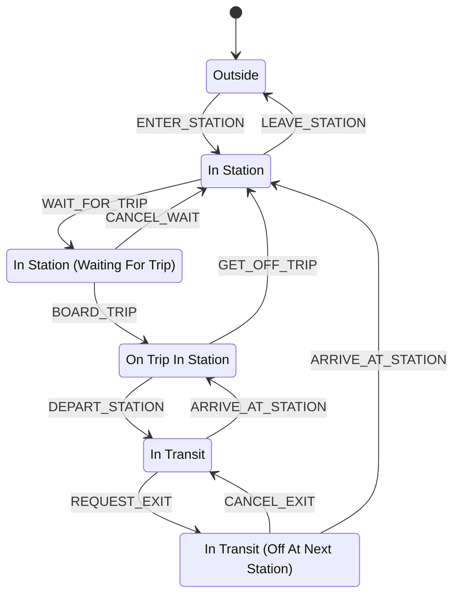

# Game State Machine

This is the agreed definition of the player's finite state machine (FSM).
It has **six states**, **eleven allowed transitions**, and starts in **Outside**.
Runtime integration will be added separately.

## States

| State | Meaning |
| --- | --- |
| Outside | The player is outside the station. This is the initial state. |
| In Station | The player is inside the station and off the train. |
| In Station (Waiting For Trip) | The player is waiting to board a trip. |
| On Trip In Station | The player is aboard a train stopped at a station. |
| In Transit | The player is aboard a moving train and plans to stay aboard at the next stop. |
| In Transit (Off At Next Station) | The player is aboard a moving train and has requested to get off at the next station. |

“On Train In Station” refers to **On Trip In Station**; it is not an additional
state.

## State diagram

## Allowed transitions

| Current state | Event | Next state |
| --- | --- | --- |
| Outside | `ENTER_STATION` | In Station |
| In Station | `LEAVE_STATION` | Outside |
| In Station | `WAIT_FOR_TRIP` | In Station (Waiting For Trip) |
| In Station (Waiting For Trip) | `CANCEL_WAIT` | In Station |
| In Station (Waiting For Trip) | `BOARD_TRIP` | On Trip In Station |
| On Trip In Station | `GET_OFF_TRIP` | In Station |
| On Trip In Station | `DEPART_STATION` | In Transit |
| In Transit | `ARRIVE_AT_STATION` | On Trip In Station |
| In Transit | `REQUEST_EXIT` | In Transit (Off At Next Station) |
| In Transit (Off At Next Station) | `CANCEL_EXIT` | In Transit |
| In Transit (Off At Next Station) | `ARRIVE_AT_STATION` | In Station |

## Rules

- Only the transitions listed above are allowed. Every other state/event
  combination is rejected without changing the state.
- `GET_OFF_TRIP` allows the player to get off immediately while the train is
  stopped. While moving, the player uses `REQUEST_EXIT` instead.
- `ARRIVE_AT_STATION` keeps the player aboard in **On Trip In Station** unless
  an exit was requested. With an exit requested, arrival takes the player
  directly to **In Station**.
- `CANCEL_EXIT` means the player will stay aboard at the next arrival.
- `LEAVE_STATION` is available only in **In Station**. A waiting player must
  cancel waiting first; an onboard player must get off first.
- Arrival and departure events describe state changes. Their automatic timing
  and triggers will be defined when scheduling is implemented.

## Validation scenarios

1. **Complete journey:** start Outside, enter, wait, board, depart, request an
   exit, arrive in the station, and leave to return Outside.
2. **Immediate disembarkation:** enter, wait, board a stopped train, and use
   `GET_OFF_TRIP` to return to In Station before departure.
3. **Stay aboard:** alternate `DEPART_STATION` and `ARRIVE_AT_STATION` across
   multiple stops, remaining aboard until an exit is chosen.
4. **Cancel waiting:** `CANCEL_WAIT` returns a waiting player to In Station.
5. **Cancel an exit:** request an exit while moving, cancel it, and verify the
   next arrival leaves the player aboard in On Trip In Station.
6. **Reject invalid actions:** boarding from Outside, leaving while waiting or
   onboard, and `GET_OFF_TRIP` while in transit all leave the state unchanged.

## Scope

This document defines the FSM only. Runtime code, UI controls, fares and wallet
deductions, station/trip data, and automatic scheduling remain for later work.
The existing clock and wallet are not connected to these transitions yet.
